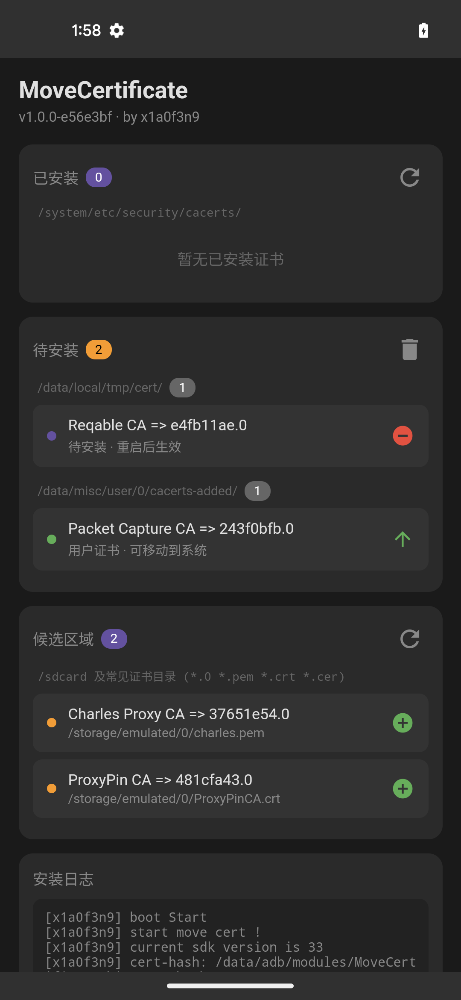
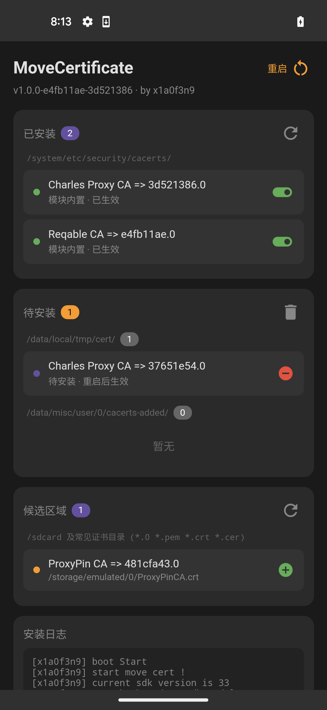

# MoveCertificate

[English](#english) | 中文

支持 Android 7 - 16，兼容 Magisk / KernelSU / APatch

基于 [ys1231/MoveCertificate](https://github.com/ys1231/MoveCertificate) 二次开发，更方便个人/群控使用的版本。告别各种繁琐步骤：
- 不再需要 手机设置的证书安装程序
- 批量安装时不再需要证书计算hash
- 不再需要 shell命令
- 不再需要 证书格式转换；

## 使用方法

**方法1：CI 内置证书（适合群控/刷机党，无需本地环境）**

有两种方式通过 CI 内置证书：

- **方案A（推荐）**：使用 GitHub Secrets（无需 fork，私密性更好）
  1. 进入仓库 **Settings → Secrets and variables → Actions**
  2. 点击 **New repository secret**
  3. Name 填 `CERT_1`（支持 CERT_1 到 CERT_5，最多 5 个证书）
  4. Value 粘贴证书内容，支持两种格式：
     - **PEM 格式**：直接粘贴完整内容 `-----BEGIN CERTIFICATE-----...-----END CERTIFICATE-----`
     - **Base64**：`cat cert.pem | base64 -w0`
  5. 进入 **Actions** 标签页，手动触发 workflow 或 push 代码触发构建
  6. 从 Actions 下载生成的模块 zip

- **方案B**：Fork 仓库推送证书文件
  1. Fork 本仓库
  2. 把证书文件（.pem/.crt/.cer）放到 `certificates/` 目录
  3. Push 触发 GitHub Actions 自动构建
  4. 从 Actions 或 Releases 下载模块

**方法2：adb 推送安装（Magisk/KernelSU/APatch 通用）**

推送各种类型的证书到指定目录

```bash
# 支持任意格式，重启时自动转换
adb push cert.pem /data/local/tmp/cert/
adb reboot
```

**方法3：WebUI 安装（KernelSU/APatch）**

推送各种类型的证书到候选目录

我一般是点击抓包软件app中的导出证书，如reqable
```bash
adb push cert.pem /sdcard/Download/
# 模块 → ⚙️ → 候选区域点 ➕ → 重启
```




## 本地构建

```bash
./build.sh                    # 默认构建
./build.sh -v v1.1.0          # 指定版本
./build.sh -c ./my-certs      # 内置证书
```

---

<a name="english"></a>
# MoveCertificate (English)

Supports Android 7 - 16, compatible with Magisk / KernelSU / APatch

Enhanced [ys1231/MoveCertificate](https://github.com/ys1231/MoveCertificate) for easier personal/batch deployment.

## New Features

- Auto-convert `.pem` `.crt` `.cer` to system format (.0), no manual hash calculation
- Built-in cert-hash tool, works on Magisk/KernelSU/APatch
- WebUI certificate management (KernelSU/APatch) with details viewer

## Usage

**Method 1: CI bundled certs (for batch deployment, no local env needed)**

Two ways to bundle certs via CI:

- **Option A (Recommended)**: Use GitHub Secrets (no fork needed, more private)
  1. Go to repo **Settings → Secrets and variables → Actions**
  2. Click **New repository secret**
  3. Name: `CERT_1` (supports CERT_1 to CERT_5, max 5 certs)
  4. Value: paste cert content, supports two formats:
     - **PEM format**: paste full content `-----BEGIN CERTIFICATE-----...-----END CERTIFICATE-----`
     - **Base64**: `cat cert.pem | base64 -w0`
  5. Go to **Actions** tab, manually trigger workflow or push code to trigger build
  6. Download generated module zip from Actions

- **Option B**: Fork repo and push cert files
  1. Fork this repo
  2. Put cert files (.pem/.crt/.cer) in `certificates/` directory
  3. Push to trigger GitHub Actions build
  4. Download module from Actions or Releases

**Method 2: adb push (Magisk/KernelSU/APatch)**
```bash
# Any format supported, auto-convert on reboot
adb push cert.pem /data/local/tmp/cert/
adb reboot
```

**Method 3: WebUI (KernelSU/APatch)**
```bash
adb push cert.pem /sdcard/Download/
# Module → ⚙️ → Click ➕ in Candidates → Reboot
```

## Build

```bash
./build.sh                    # Default
./build.sh -v v1.1.0          # Custom version
./build.sh -c ./my-certs      # Bundle certs
```
