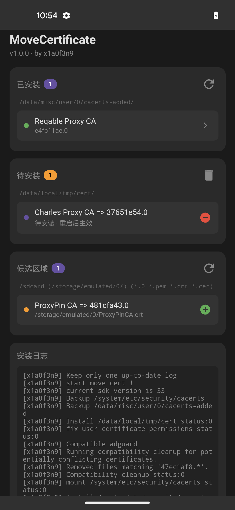

# MoveCertificate

[English](#english) | 中文

支持 Android 7 - 16，兼容 Magisk / KernelSU / APatch

基于 [ys1231/MoveCertificate](https://github.com/ys1231/MoveCertificate) 二次开发，更方便个人/群控使用的版本。告别各种繁琐步骤：
- 不再需要 手机设置的证书安装程序
- 批量安装时不再需要证书计算hash
- 不再需要 shell命令
- 不再需要 证书格式转换；

## 使用方法

**方法1：模块内置证书（适合群控/刷机党）**
- 方案A: Fork 仓库 → 把证书放 `certificates/` 目录 → push 触发构建
- 方案B: Actions → Run workflow → 粘贴证书 base64 → 下载模块
  - 获取 base64: `cat cert.pem | base64 -w0`
  - 多个证书用 `|||` 分隔

**方法2：模块自动安装（Magisk/KernelSU/APatch 通用）**

推送各种类型的证书到指定目录

```bash
# 支持任意格式，重启时自动转换
adb push cert.pem /data/local/tmp/cert/
adb reboot
```

**方法3：模块的WebUI 安装（KernelSU/APatch）**

推送各种类型的证书到候选目录

我一般是点击抓包软件app中的导出证书，如reqable
```bash
adb push cert.pem /sdcard/Download/
# 模块 → ⚙️ → 候选区域点 ➕ → 重启
```



## 本地构建

```bash
./build.sh                    # 默认构建
./build.sh -v v1.1.0          # 指定版本
./build.sh -c ./my-certs      # 内置证书
```

---

<a name="english"></a>
# MoveCertificate (English)

Supports Android 7 - 16, compatible with Magisk / KernelSU / APatch

Enhanced [ys1231/MoveCertificate](https://github.com/ys1231/MoveCertificate) for easier personal/batch deployment.

## New Features

- Auto-convert `.pem` `.crt` `.cer` to system format (.0), no manual hash calculation
- Built-in cert-hash tool, works on Magisk/KernelSU/APatch
- WebUI certificate management (KernelSU/APatch) with details viewer

## Usage

**Method 1: adb push (Magisk/KernelSU/APatch)**
```bash
# Any format supported, auto-convert on reboot
adb push cert.pem /data/local/tmp/cert/
adb reboot
```

**Method 2: Bundled certs (for batch deployment)**
- Option A: Fork repo → put certs in `certificates/` → push to trigger build
- Option B: Actions → Run workflow → paste cert base64 → download module
  - Get base64: `cat cert.pem | base64 -w0`
  - Multiple certs: separate with `|||`

**Method 3: WebUI (KernelSU/APatch)**
```bash
adb push cert.pem /sdcard/Download/
# Module → ⚙️ → Click ➕ in Candidates → Reboot
```

## Build

```bash
./build.sh                    # Default
./build.sh -v v1.1.0          # Custom version
./build.sh -c ./my-certs      # Bundle certs
```
